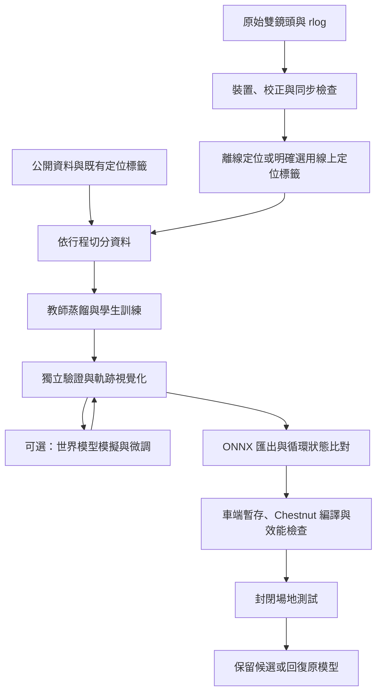

# DGX Spark 駕駛模型實驗室

從 Comma 3X／comma four 原始紀錄取得影像與標籤，在 DGX Spark 訓練與視覺化，再匯出供 sunnypilot＋Chestnut 封閉場地測試的候選模型。

這裡交付的是可執行的工程流程。**尚未在 Tony 的 Spark、真實 EV6 紀錄或 Chestnut 上完成整合實測，沒有已訓練完成或已驗證可上路的權重。**本機測試使用隨機初始化模型檢查匯出與格式，不能視為駕駛能力驗證。

## 開始使用

在 Spark 建立獨立的工作目錄。使用稀疏 checkout，只取得實驗室工具，不下載整套 sunnypilot 車端模型：

```bash
GIT_LFS_SKIP_SMUDGE=1 git clone --filter=blob:none --sparse --single-branch --branch distill-lab-spark https://github.com/TonyBinheWu/sunnypilot.git spark-driving-lab
cd spark-driving-lab
git sparse-checkout set tools/distill_lab
cd tools/distill_lab
bash bootstrap.sh
bash gui.sh
```

先安裝 `uv`、`ffmpeg` 與 `rsync`。`bootstrap.sh` 使用上游鎖定的 Python 3.12、PyTorch／CUDA 套件，新增 Streamlit、Jupyter 與 TensorBoard，最後執行環境檢查。可能下載數 GB 依賴；請依 Spark 的實際可用 SSD 容量保留影片、快取與 checkpoint 空間。程式不會自動修改驅動或升級作業系統。

在其他電腦操作 Spark：

```bash
ssh -N -L 8501:127.0.0.1:8501 spark
```

`spark`、`comma` 是你自己設定的 SSH 主機別名。在 Windows 瀏覽器開啟 [http://127.0.0.1:8501](http://127.0.0.1:8501)。服務預設只監聽 Spark 的 localhost，透過 SSH 通道操作。

網頁提供總覽、資料、訓練、評估與匯出、模擬與微調、車端部署、工作紀錄七個頁面。工作在獨立程序執行，關閉網頁不會中斷訓練。操作步驟與限制見 [GUI 操作手冊](docs/GUI_zh-TW.md)。

已安裝舊版時，更新分支後執行 `uv pip install --python upstream/.venv/bin/python -r requirements-ui.txt`，再執行 `bash gui.sh`。不用重新下載核心訓練環境。

原本的 Notebook 保留：`upstream/.venv/bin/jupyter lab --ip=127.0.0.1 workflow.ipynb`，選擇 **「駕駛模型實驗室 · DGX Spark」** kernel。不要從 Notebook 與 GUI 同時修改同一份實驗。

## 全流程



完整操作見 [操作手冊](docs/WORKFLOW_zh-TW.md)，車端操作見 [部署與回復](docs/DEPLOYMENT_zh-TW.md)，限制與測試範圍見 [驗證紀錄](docs/VALIDATION.md)。

## 3X 與 comma four 如何處理

不是把 3X 偽裝成 comma four。程式保留 `initData.deviceType`，讀取實際 `narrowRoadCameraState.sensor`，依來源攝影機套用內外參。

基準程式的 AR0231／OX03C10 影像設定是 1928×1208；OS04C10 設定是 1344×760，焦距也不同。拍到相同道路不代表原始張量、視角、校正與時間完全相同。**解析度不符時停止處理，不會默默縮圖讓它通過。**

| 資料 | 本版處理 |
|---|---|
| 3X `tizi`／3 `tici`／four `mici`，完整新格式 rlog＋UBlox | 保留真實裝置與 sensor，沿用上游 GNSS＋姿態融合 |
| 含有效 `liveLocationKalman` ECEF 的紀錄 | 可明確選擇 `--method logged-ecef`，標記為線上濾波研究標籤 |
| 只有影片／qcamera／螢幕錄影 | 拒絕，缺少時間、校正與動作標籤 |
| 只有 QCOM 原始 GNSS、沒有有效 ECEF 狀態 | 尚未實作該 GNSS 接收器的離線轉接；報告具體缺失 |
| 太舊、無必要欄位、校正重設、雙鏡頭錯位 | 拒絕該片段，原始檔保留 |

## 提供的工具

- `lab.py fetch-device`：以 SSH／rsync 讀取指定行程的雙鏡頭及完整 rlog。
- `fetch-public`：下載指定 comma1M 片段與完整標籤，保存實際資料版本。
- `prepare`／`prepare-route`／`localize`：資料匯入、攝影機驗證、定位與來源紀錄。
- `split`：將同一趟行程的所有片段放在同一組，避免相鄰片段洩漏至驗證組。
- `train`／`evaluate`：本地 TensorBoard、JSONL、定期 checkpoint、續訓及教師比較。
- `worldmodel-download`／`worldmodel-server`／`simulate`／`rl-train`：上游世界模型與 DAgger 風格微調流程。
- `export`：匯出有循環特徵與 `output_slices` 的模型，對比 PyTorch、ONNX Runtime 的輸出。
- `car.py`：車端暫存、編譯、效能檢查、封閉場地候選啟用、完整 chunk 備份與回復。

資料與權重位於 `work/`，已排除 Git 追蹤。工具預設使用本地 TensorBoard，不會自動把你的路線、影片或訓練結果上傳到 W&B。工具在匯入 ONNX Runtime 前設定 `ORT_DISABLE_TELEMETRY=1`，並在建立 session 前呼叫停用 API；若 Notebook 已載入該套件，請先重啟 kernel。

## 固定版本與授權

- openpilot.distill：`294d57a919cc384386349a22ac5c9cc02d5edb99`。
- 教師模型來源：commaai/openpilot `084747c75d2cbd23af65ab7a9e770bbd7b98bac9`。
- 車端介面基準：TonyBinheWu/sunnypilot `ca717be308d052389ac54beaa9eed1923b704e07`。
- 修改清單、原作者授權與可重現範圍：[UPSTREAM.md](UPSTREAM.md)、[上游 MIT 授權](upstream/LICENSE)。公開資料沿用其資料集授權，與程式的 MIT 授權分開。
